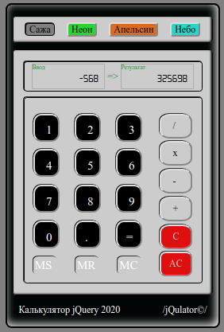

# jQulator

<h3>jQulator - веб-калькулятор. Калькулятор способен считать неограниченное количество операций до вывода результирующих данных. В целом, попытка сымитировать реальный счетный не инженерный инструмент. Учебная работа по теме jquery.</h3>

На данный момент реализовано:
 --разделены поля ввода и вывода чисел
 --переключение тем оформления.
 --корректный ввод положительных чисел, в том числе дробей.
 --корректный ввод и работа с отрицательными числами. Важно: ввод отрицательного значения не экранируется от набора предшествующей операции. Происходит именно смена типа операции на тип Вычитание. Пример: цепочка "-3+68/ (-5)" и тд станет цепочкой вида "-3+68-5".
 --основные арифметические функции.
 --очистка последнего введенного числа и полная очистка поля ввода.
 --функции работы с памятью.
 --функции округления десятичных дробей (с плав. точкой/два знака/три знака.
 --функция генерации псевдослучайного числа в диапазоне 1-10

Планируется:
 --экранировка отрицательных значений и кусков цепочки в серии операций (вопрос изучается).

Публичная ссылка <https://ipoluhin.github.io/jQulator/>

 
