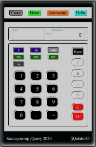

# jQulator

<h3>jQulator - веб-калькулятор. Калькулятор способен считать неограниченное количество операций до вывода результирующих данных. В целом, попытка сымитировать реальный счетный не инженерный инструмент. Учебная работа по теме jquery.</h3>

На данный момент реализовано:
 --разделены поля ввода и вывода чисел
 --переключение тем оформления.
 --корректный ввод положительных чисел, в том числе дробей.
 --корректный ввод и работа с отрицательными числами. Важно: ввод отрицательного значения не экранируется от набора предшествующей операции. Происходит именно смена типа операции на тип Вычитание. Пример: цепочка "-3+68/ (-5)" и тд станет цепочкой вида "-3+68-5".
 --основные арифметические функции.
 --очистка последнего введенного числа и полная очистка поля ввода.
 --функции работы с памятью.
 --функции округления десятичных дробей ([условно]с плав. точкой/два знака/три знака.
 --функция генерации псевдослучайного числа в диапазоне 1-10
 --функция рассчета квадратного корня введенного числа

Планируется:
 --экранировка отрицательных значений и кусков цепочки в серии операций (вопрос изучается).

Известные ошибки:
 -- цепочка 0 _ число = _ второе_число =' выводит результат произведения указанных двух чисел. В данном случае некорректно воспринимается начальное условие, что и приводит к неверному рассчету. Причина: (пример) комбинация \* число выводит число, т.е. не воспринимается, как умножение ноля на число.
Замечено, что у разных калькуляторов действия с такой цепочкой имеют разные результаты: либо само число, либо его квадрат. В моем приложении результатом остается само число, а не его квадрат, что и порождает вышеуказанную ситуацию с умножением на ноль.

Публичная ссылка <https://ipoluhin.github.io/jQulator/>

 
